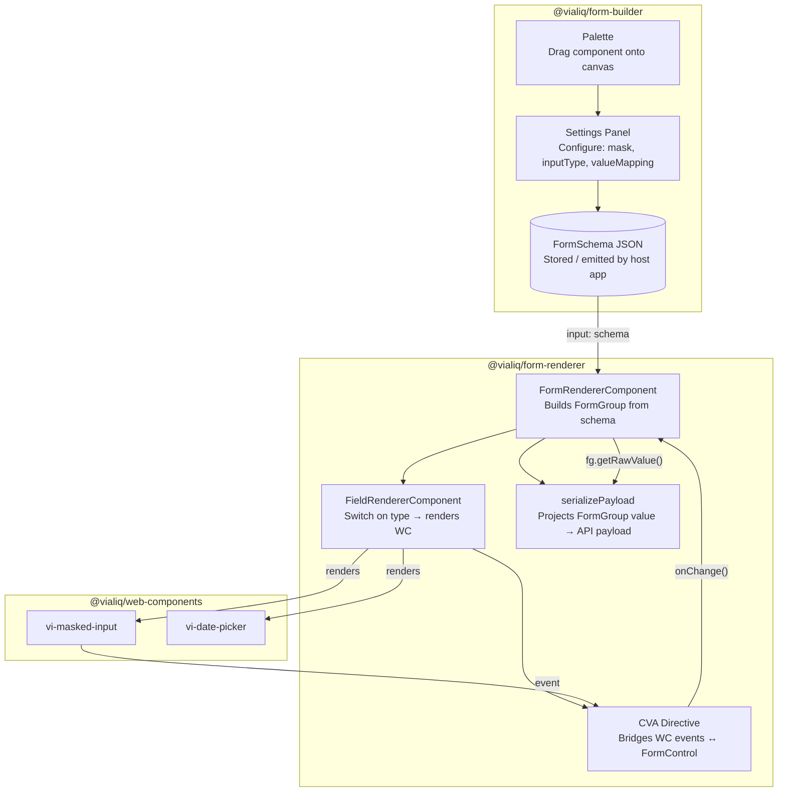

# Form Builder: Concepts & Architecture

## Overview
The Vialiq dynamic form system is split into two primary libraries to separate the concerns of *designing* a form from *running* a form:

1. `@vialiq/form-builder`: A visual drag-and-drop editor that allows users to design forms. It outputs a `FormSchema`.
2. `@vialiq/form-renderer`: A lightweight runtime that takes a `FormSchema` and dynamically renders it as a live Angular Reactive Form.

The contract between these two libraries is the **FormSchema JSON document**. The builder produces it; the renderer consumes it.

## High-Level Architecture



## The Schema Contract

The `FormSchema` is a serializable JSON object. It contains metadata (like the form's title) and an array of `ComponentSchema` objects. 

Each `ComponentSchema` represents a node in the form. It uses a discriminated union pattern based on the `type` property.

```json
{
  "schemaVersion": 1,
  "id": "form-1",
  "title": "User Registration",
  "components": [
    {
      "id": "field-abc123",
      "type": "text-input",
      "key": "firstName",
      "label": "First Name",
      "required": true
    },
    {
      "id": "layout-xyz",
      "type": "columns",
      "layoutConfig": {
        "columns": 2,
        "columnAssignments": {
          "field-def456": 0,
          "field-ghi789": 1
        }
      },
      "components": [ ...nested children... ]
    }
  ]
}
```

### Key Principles of the Schema
1. **Strictly Typed**: The schema interfaces (e.g., `TextInputComponentSchema`, `ColumnsLayoutSchema`) define exactly what properties are allowed.
2. **Recursive**: Layout components (like Columns, Tabs, Content Switcher) have a `components` array, allowing infinite nesting of child elements.
3. **Data Agnostic**: The builder doesn't care *what* the schema is saved to (local storage, database, etc.). It simply emits the schema when changed.
4. **Versioning**: The root `FormSchema` contains a `schemaVersion` property. This is critical for future-proofing. If the JSON structure of a control changes in v2, the renderer can run a migration function on older schemas before rendering them.
5. **Component IDs**: Every node has a unique `id` (UUID). This is strictly for internal builder usage (drag-and-drop targeting, Angular `@for` tracking, and state tree mutation). The `id` is *never* used for data binding.
6. **Key Uniqueness**: Every input component that captures data must have a unique `key`. This is the property used for actual data binding and API payloads. The builder's `KeyGeneratorService` ensures keys are unique when a component is dropped from the palette or duplicated. Host apps generating schemas programmatically *must* ensure keys are globally unique within the form.

## Dual-Value Controls & Value Mapping

Some web components produce complex values rather than plain strings. For example, a Date Picker might output an ISO string (`"2025-01-15"`), a localized string (`"15/01/2025"`), and a raw structured object (`{ day: 15, month: 1, year: 2025 }`). 

To handle this, the system uses an in-memory `FieldValue<T>` object within the Angular `FormControl`, and a `valueMapping` property in the schema to tell the `FormRenderer` which format the backend API expects when the form is finally submitted.

```typescript
interface FieldValue<TRaw = unknown> {
  value: string;
  displayValue: string;
  rawValue: TRaw;
}
```
